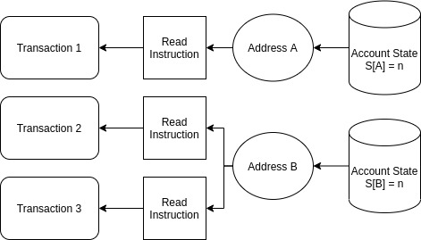
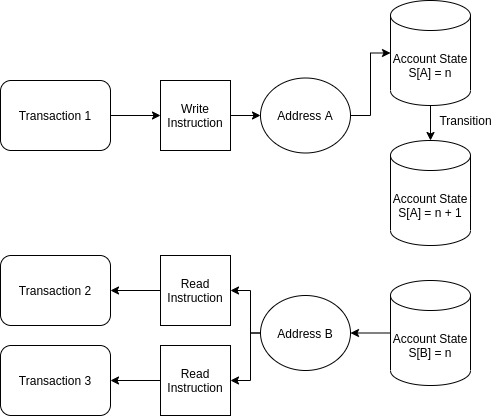
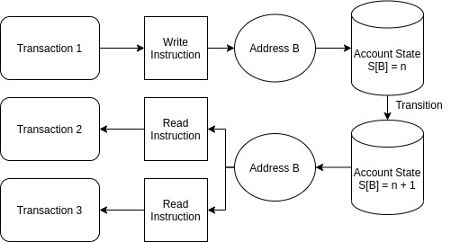
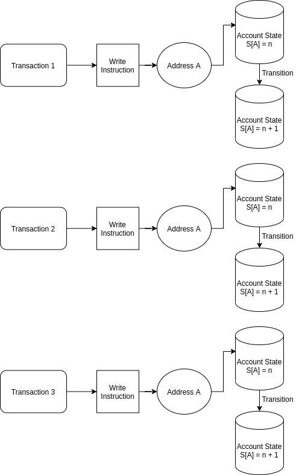
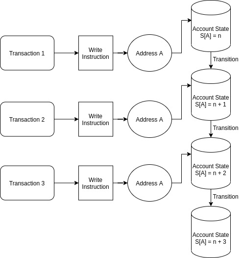
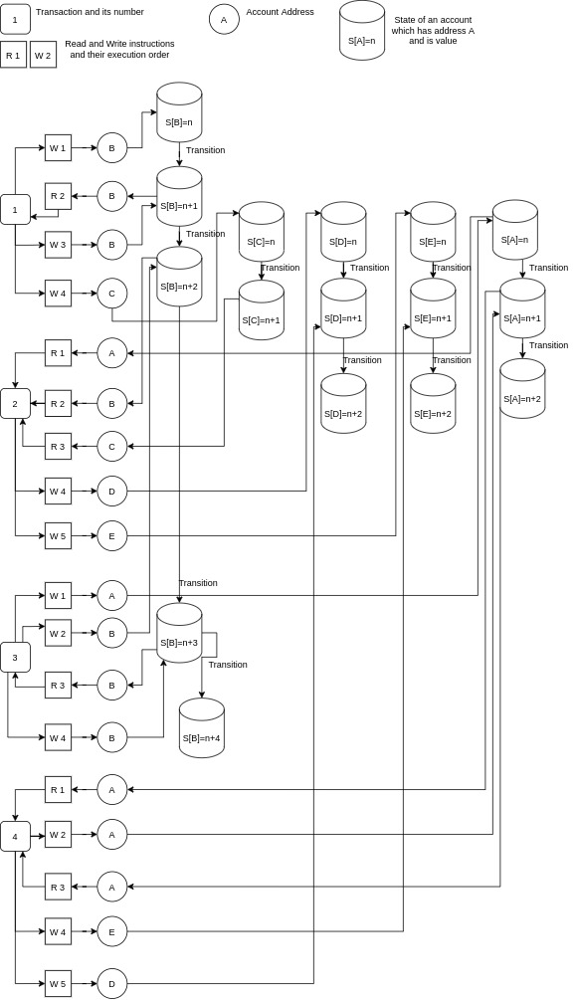
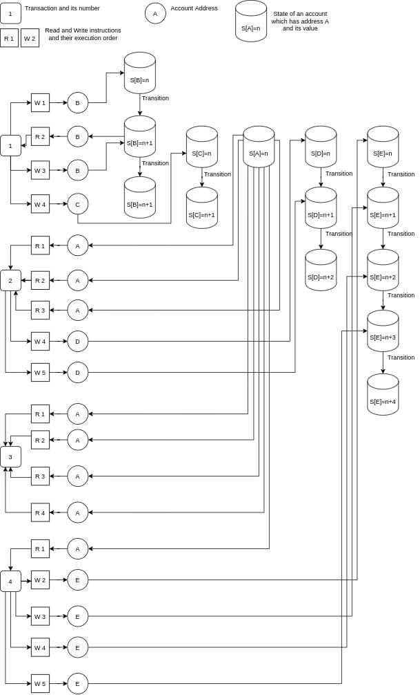

# In which cases transactions in a block can be executed independently?

Assuming that a block has more than a single transaction, there are variety of ways where transactions in this block can be executed independently. For simplicity purposes we use single capital letter as an address,  unknown integer value `n` as a state of an account and each write instruction increases state value `n` by one.

Let's investigate these "variety of ways".

## Easy

\
*diagram 1.1*

As shown on simplified image above, in this case all we do is read information. No metter if we read from many different  accounts, state of an account(s) is always the same, no transitions are applied. Thus these transactions can be executed independently. Since they do not dependant on each other, they can be executed in parallel. Thus we can say that if no state transitions are applied to an account(s) by all transactions in a block then all of them can be executed independantly. The simplest.

## Medium

\
*diagram 2.1*

In this diagram we have 3 transactions, one of them changes the state of an account that has address `A`, while two other transactions read account state which has address `B`. `Transaction 2` and `Transaction 3` don't need to know what changes `Transaction 1` does, since they are simply do not require any information from that account. So in this case they are also independent.

Let's consider a modified version of diagram above. Image below shows sequential (dependant) execution of transactions. First transaction changes the state of an account with address `B`, and then other two transactions read information from the same account. If they were executed independently, then `Transaction 2 and 3` would not be able to get the lastest update. `Transaction 2 and 3` depend on `Transaction 1` and it has to be executed sequentially. First example of relation.

\
*diagram 2.2*

Let's start to look at a bit more complicated examples.

\
*diagram 2.3*

On *diagram 2.3* we have three transactions, each of them apply changes to the same account and all of them doing that at the same time or in parallel. In result the state of an account will end up having single transition when we applied three. This is not what we want. What we want is shown below.

\
*diagram 2.4*

Here what we do is we execute transactions sequentially. In result state of an account changed three times.

It is obvious, if we have two (or more) transactions that change the state of the same account, it is required to execute these transactions sequentially. Otherwise we will not be able to apply all transitions. State of an account would not be valid. And if we read that state of that account at the same time, we would get invalid information. 

## Hard
Now, we've seen importance of state transition and understood the sequantial/relational and parallel/independant execution. 

All of previous examples were raltively simple. We had only three transactions. All of them had single read or write instruction and non of them had both and many of them. All of them had single address to work on. So let's take a look at another diagram.

\
*diagram 3.1*

Let's investigate this diagram. We have four transactions, each of them perform at least four read/write instructions. And we have five different addresses: `A, B, C, D, E`. 

First transaction:
1. changes the state of `B`
2. reads the state of `B`
3. changes the state of `B`
4. changes the state of `C`

Second transaction:
1. reads the state of `A`
2. reads the state of `B`
3. reads the state of `C`
4. changes the state of `D`
5. changes the state of `E`

Third transaction:
1. changes the state of `A`
2. changes the state of `B`
3. reads the state of `B`
4. changes the state of `B`

Fourth transaction:
1. reads the state of `A`
2. changes the state of `A`
3. reads the state of `A`
4. changes the state of `E`
5. changes the state of `D`

Since second transaction reads states of `B` and `C`, and first transaction changes them, we can say that second depends on first. Third transaction also reads state of `B`, so it depends on first transaction as well. But does it depend on second? Well, looks like it does not. Third transaction does not depend on second, and order of a second transaction is above third, which means it does not depend on third as well. So... can they be executed in parallel? 

Since second and third transactions perform instructions on account `A`, let's consider this scenario - second and third transactions started execution at the same time, in parallel. Second transaction has a lot of logic to deal with before reading the state of `A`. While third transaction does not have that much logic to deal with, so it started and finished state transition of an `A`.
When second transaction starts reading the state of `A` it will read not what it meant to - the state of an `A` after first transaction's transitions ended. Instead, it will read the result of applied transitions after third transaction is done executing its code. Is this possible scenario? Yes. So they can't be executed in parallel. 

Lastly, fourth transaction. It depends on third, since it reads the state of `A` and third changes it. So fourth depends on third. Overall there is no way this transactions can be executed independently. These transactions must be executed sequentially.

Consider another diagram.

\
*diagram 3.2*

We still have four transactions and five different accounts. 

First transaction, as before:
1. changes the state of `B`
2. reads the state of `B`
3. changes the state of `B`
4. changes the state of `C`

Second transaction:
1. reads the state of `A`
2. reads the state of `A`
3. reads the state of `A`
4. changes the state of `D`
5. changes the state of `D`

Third transaction:
1. reads the state of `A`
2. reads the state of `A`
3. reads the state of `A`
4. reads the state of `A`

Fourth transaction:
1. reads the state of `A`
2. changes the state of `E`
3. changes the state of `E`
4. changes the state of `E`
5. changes the state of `E`

Let's see if second depends on first. Does second read the state of any account that first transaction is applying transitions? No. Does second apply transitions to account state that first reads? No.

Does third depend on first? No.
Does third have realtion to second? Does it read or modifies the state of account that second works on? No.

Does fourth depend on first? No. Does fourth depend on second? No.
Does fourth depend on third? Does it read or modifies the state of account that third works on? No.

No transaction in this example modifies the state of an account that other transactions read. They can be executed independantly.

To conclude, if we want to find out if transactions in a block can be executed in parallel without interfering with each other first we need to find read and write instructions of every transaction, so we can find addresses each transaction accesses. How do we do this? [Check this to find out.](/docs/02_instructions.md)  