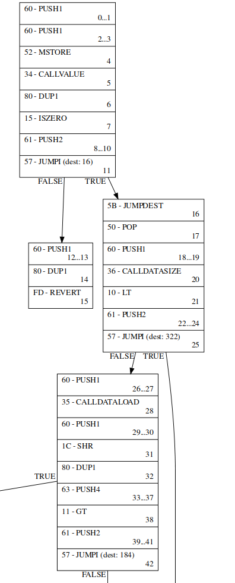
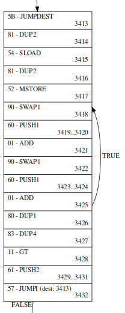

# Ethereum VM instructions and bytecode preprocessing.

As we stated in [this document](./01_transactions.md), if we want to find out if transactions in a block can be executed in parallel without interfering with each other, first we need to find read and write instructions of every transaction, so we can find which accounts each transaction accesses. From there we can make a conclusion - they should be executed sequentially one after another, or they can be executed in parallel, all at the same time.

## Read and write instructions

In [this table](https://docs.google.com/spreadsheets/d/e/2PACX-1vS0ungUTs_SkqaSrp7oghcOEZr3oCJJMcIR9rk42s4tAzggDLE4jAQDifXXZu9rNqq2BK-HnDP7bzB9/pubhtml) some rows filled with bright colors. We are interested only in two colors:
- `light blue` - access point is always known
- `orange` - access point is not known ahead of time

`light blue` instructions are: `SELFBALANCE, SLOAD, SSTORE` and their access point is always known - address of contract that is in current execution frame. So if interpreter at some point executes these instructions, we know that it targets contract address. If instruction is `SELFBALANCE` or `SLOAD` it reads the state, and if instruction is `SSTORE` it modifies the state. 

`orange` instructions: `BALANCE, EXTCODESIZE, EXTCODECOPY, EXTCODEHASH` are all read instructions and their access point is not known ahead of time. So if interpreter at some point executes these instructions, we must ensure that at this point these instructions operate on right address. 

But how do we know if interpreter at some point may encounter `light blue` and/or `orange` instructions, so we can say "oh, okay... this transaction accesess these set of addresses"? We probably have to make some kind of preprocessing to determine it.

## Preprocessing

In the following image we can see part of the visualised bytecode execution paths. Every time we have conditional jump `JUMPI` instruction - there is a split. 

\
*graph 1. first 4 nodes. /images/748348_0_jumps.svg*

If we take a look at the full picture (`/images/748348_0_jumps.svg`), there are many possibile ways interpreter may follow. <i>(Or is it always the same single way? Does it depend on contract input? This is the question I am personally trying to answer. If you know, let me know, I'd appreciate. But for now let's assume that it is not the case.)</i>

There are many possible ways interpreter may follow. Obviously, if we want to find out all read and write instructions we have to go down every path and keep track of accessing points. Sounds easy, right? How about loops? Let's see.

\
*graph 2. loop. /images/748348_0_jumps.svg*

Currently, in this preprocessing, loops will run untill `JUMPI` condition is `false` or untill 1000 loop cycles are made, no more, this is the limit. If after 1000 cycles condition is still `true`, then analysis failed - we can't say if transactions in a block depend on each other. 

You may ask yourself "But why do we need to execute loops, if all we need is access points?". The answer is simple - to keep stack values valid. So when we passed the loop and somewhere down the path we would not get some kind of an error, because stack value was `x`, but if we had executed loop we would get `y`.

Okay, done with loops. We will go down every path and keep track of every access point. But some instructions may create new nested execution frames - `purple` instructions: `CALL, CALLCODE, DELEGATECALL, STATICCALL` for message call and `CREATE, CREATE2` for contract creation. Is there is chance that in a new execution frame there would be read and/or write instructions? Absolutely. So we have to keep track of this access points as well, correct? Yes.

Here is the problem. Nested frames may create another nested frame. And this frame may create another one and that one creates another. System at some point may run out of memory, because of too many recursions. That is why in this preprocessing number of recursions limited to 4 (for speed and memory reasons), and if there are more recursions, then entire preprocessing failed. 

Another problem is that message calls expect return value, so they can store it in a EVM memory. If we look at the full image again, we can see how many `REVERT` and `RETURN` instructions bytecode may have. So if nested frames return more then 1 value then preprocessing failed, because... if there is more then that - how do we know which one is correct to use? Sure, nested calls may return many same values, that is why we use sets, to make sure all values are unique. Sets also used when keeping record of access points. And all access points of nested frames recorded as access points of the top frame.

To wrap up, if preprocessing successfully finished without failing for some reason (including interpreter errors) and we have all access points, and we know which addresses each transaction targets we can conclude if transactions in a block can be executed independetly, following the logic described in [this document](./01_transactions.md).

      

